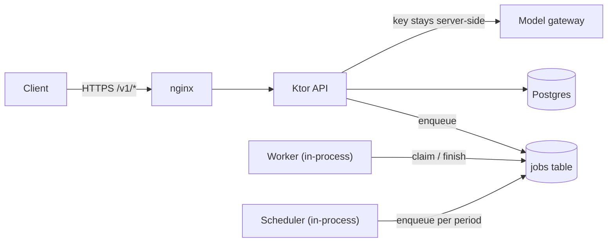
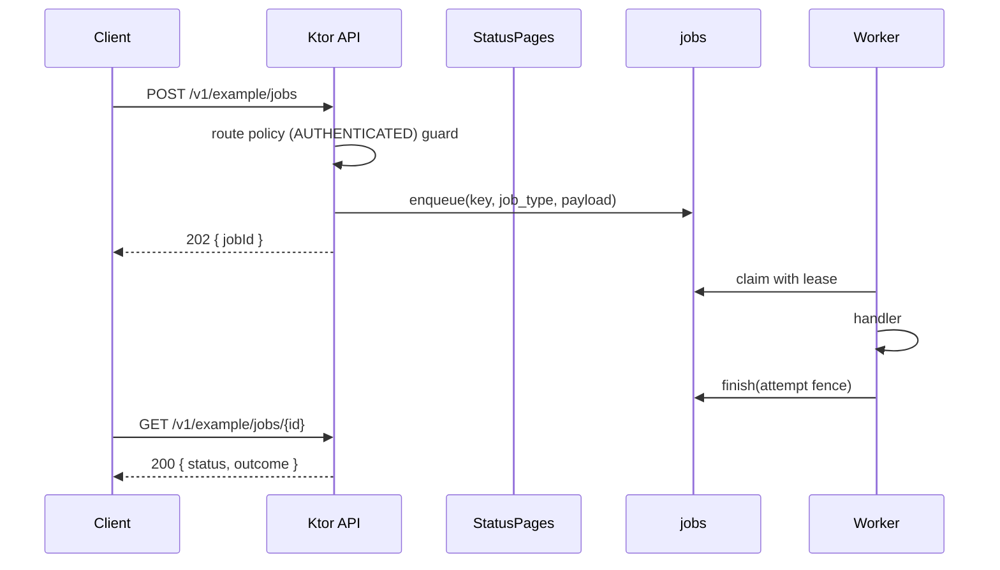

# Topology

## Boxes

- **The request path** never waits on the model. A request enqueues a job and
  returns `202`; a worker executes it.
- **The worker** is in-process and claims one job per tick from the same
  `jobs` table. The lease-and-fence makes several instances safe.
- **The scheduler** runs in-process, once a minute per instance, and enqueues
  into the same `jobs` table. The compare-and-set on `next_run_at` makes a tick
  single-flight across instances, so extra instances are safe and buy nothing.
- **Postgres** is the only durable store. A blank `DATABASE_URL` is the explicit
  local-only memory mode.

## Request lifecycle

A refusal anywhere becomes the ProblemDetail envelope through `StatusPages`.

## Deploy

One host runs Postgres and the API behind nginx, or the API under PM2. See
[`deploy.md`](deploy.md).
